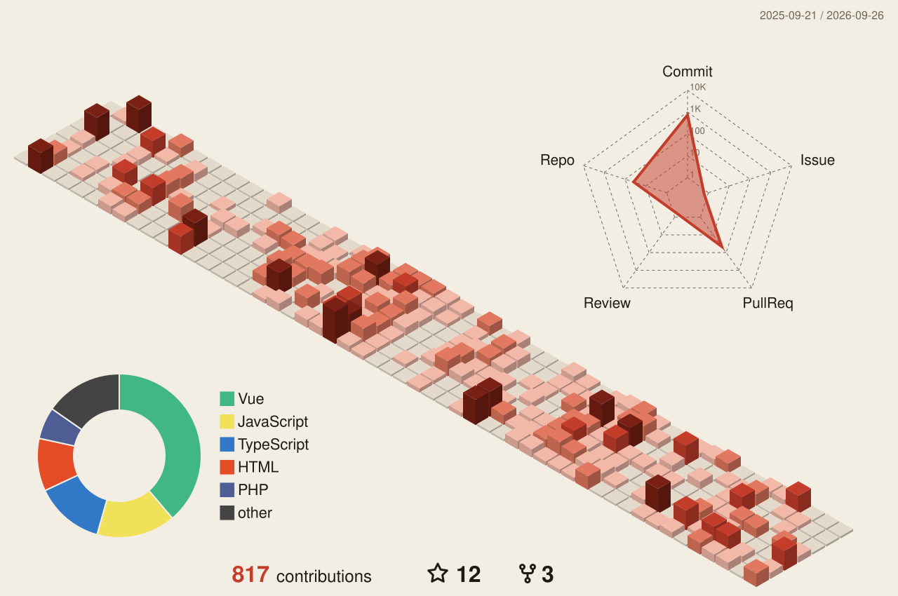

  

I build AI products for people who teach and learn, and I teach Information Systems at
Institut Teknologi Kalimantan (ITK). Every Myst Tech app started as a real problem I ran into
myself: in the classroom, in thesis supervision, or as head of my neighbourhood unit.

## Myst Tech

One private AI layer, **Myst-Core**, routes every model call behind the apps below: model
routing and fallback, structured output, vision/OCR, usage metering.

| App | For | What it does |
|---|---|---|
| [GuruPintar](https://guru.myst-tech.com/) | Junior & senior high teachers | Turns weekly grades into Kurikulum Merdeka report-card descriptions; reads handwritten answers from photos |
| [SkripsiPintar](https://skripsi.myst-tech.com/) | Bachelor's & master's students | Won't write the thesis for you, but runs a mock defense with an AI examiner and flags ghost citations |
| [Asdos-AI](https://asdos.myst-tech.com/) | Lecturers & teaching assistants | Grades assignments against your rubric and maps class misconceptions every week |
| [Sistem Manajemen RT](https://rt.myst-tech.com/) | RT officers & residents | Resident letters, records, dues and monthly reports in one app |
| Jarvis Myst | Everyone | Voice assistant in Bahasa Indonesia. In development |

All of them live at **[myst-tech.com](https://myst-tech.com)**.

## What I work on

- **AI engineering:** LLM gateway design, RAG, model routing & fallback, prompt registries, structured JSON output, vision/OCR
- **Architecture:** monolith & microservices, REST API design, data modelling, application security
- **Cloud & infrastructure:** Docker, Portainer, Proxmox VE, VirtualBox, Linux servers, CI/CD, AWS
- **IoT & networking:** ESP32, Arduino, MQTT, wireless sensor networks, network security
- **Teaching & research:** information systems, thesis supervision, published research

I ship with an AI-assisted workflow (Claude Code), so my time goes into architecture,
infrastructure and the problem itself rather than boilerplate.

  
  
  
  
  
  
  
  
  
  
  
  
  

## Background

- **Founder & AI Product Engineer**, Myst Tech (2021 to present)
- **Information Systems Lecturer**, Institut Teknologi Kalimantan (2020 to present)
- **Head of Digital Innovation Laboratory**, FSTI, ITK (2024 to present)
- **Head of Neighbourhood Unit (RT)**, Balikpapan (2025 to present)
- M.Tr.Kom, Politeknik Elektronika Negeri Surabaya (2018 to 2020)
- S.Tr.Kom, Politeknik Negeri Ujung Pandang (2012 to 2016)

Publications, grants and community work are listed on my
[profile page](https://myst-tech.com/aidil/).

## Contributions

<picture>
  <source media="(prefers-color-scheme: dark)" srcset="./profile-3d-contrib/profile-sumi-dark.svg" />
  
</picture>

## Contact

[myst-tech.com](https://myst-tech.com) ·
[Profile & CV](https://myst-tech.com/aidil/) ·
[LinkedIn](https://id.linkedin.com/in/aidil-saputra-kirsan-0808911bb) ·
[aidil@lecturer.itk.ac.id](mailto:aidil@lecturer.itk.ac.id) ·
Balikpapan, Indonesia
